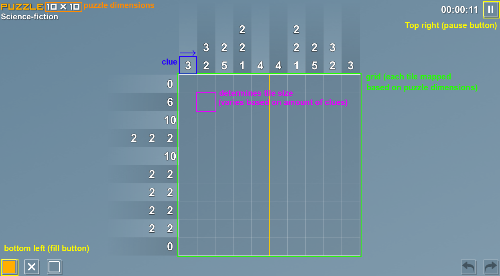
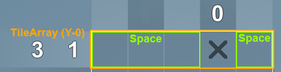

# pictopix-solver
This is a part nonogram-solver, part GUI-automation project.

Nonograms, or Picross, are picture logic puzzles where cells in a grid must be filled according to the numbers assigned to each row/column, which when complete reveals a hidden picture. Using **[Tomlab Games' Pictopix (2017)](https://store.steampowered.com/app/568320/Pictopix/)** as the application that the GUI automation is based off, the program will first take a screenshot of the game window and deduce the puzzle dimensions, grid placement, and provided topography, which will then be used to attempt to solve the puzzle in-game.

https://github.com/ant-cap/pictopix-solver/assets/61441638/d96a7161-3595-4622-838b-f84696f095c9

https://github.com/ant-cap/pictopix-solver/assets/61441638/21c66d2b-069b-4474-948b-5ae21d46c790

The program is able to solve any 5x5 puzzle with 100% success rate. 10x10 puzzles are also supported, but success rate is closer to 66%. **This first version serves more like a proof of concept rather than a completed project. I plan to improve the project to have 100% success rate over all dimensions.**

# Setup
- Ensure you have all necessary libraries installed (PyAutoGUI, PyScreeze, PIL). Installing PyAutoGUI will also install PyScreeze and PIL.
- **In-game options:**
    >**Hints** - Expert (No auto-fade, no highlighting)

    >**Video** - Resolution: 1280x720, Fullscreen: Disabled
    
    >**Interface** - Skin: Classic, Pattern: Pattern 1, Thick Line: Disabled

- Run the program when you have an active puzzle. Ensure no cells are filled or crossed.
- The project by default attempts to maximize the game window by finding and clicking the game's taskbar icon. You can disable this by setting MAXIMIZE_GAME_TAB to False.

# GUI Automation and Screen Reading

Above is a screenshot that the program will generate once it had determined the dimensions of the games' window (using the buttons highlighted in yellow). Once it has the screenshot, it will attempt to locate all other highlighted aspects of the game as labeled in the image.

PyAutoGUI has built in needle/haystack image location functionality, which is what was used to determine the position of these aspects. The **references** folder contains all of our "needle" images that the program attempts to locate on the game screenshot. For most aspects, simply taking my own in-game screenshot and cropping it around things sufficed. Accurately reading all clues, however, required a bit more workaround.

With the clues' text having antialiasing, and the background having two different alternating shades with gradient, simple needle/haystack location would not work (you can see my failed attempts in references/_unused). I needed a way to strip the clue screenshot of all unnecessary information. **My Solution:** One shared characteristic between all clues' text was the color. I took the original clue screenshot (left), and cleared all pixels that are not purely white (255,255,255), leaving me with an image that could be easily used in needle/haystack location (right).

Another problem I ran into was that each puzzle grid could vary in tile size based on the number of clue rows/columns. Simple image referencing was sufficient enough to solve this. Once the tile size was determined, the relative grid could be located, which then could be divided up by the puzzle's dimensions to map each tile's position. 

# Puzzle Breakdown and Solving 

Each row and column of the puzzle is represented by a "TileArray" object. Furthermore, each TileArray is divided into "Space" objects, which are defined as the succession of non-crossed tiles found in each array.

Once spaces are generated, they will be assigned clues, or sequences, that are certain to be located in said space.

The program will analyze every TileArray for potential cases where the puzzle can be further progressed. This is done on a per-space basis. Spaces with no clues are ignored. Once a tile's state has updated, it will call for its assigned X and Y arrays to have it's spaces updated. Deductions are done by comparing the length of the space's clues to the length of the space itself, or by checking for edge cases where a sequence of filled tiles can be extended. All moves are logically confirmed, no guessing is involved.

# Improvements

**GUI Automation:** Currently, the environment needs to be set up in a very specific way (resolution, skin, etc.). Using the same method I did with determining the clues, I could remove the skin requirement and could utilize scaling to remove the resolution limiation. Doing so could also take away some complexity of the screen-reading operation as well.

**Solving:** There are known issues with the program's decision to make moves. Because spaces are always scanned in the same order, this makes hiccups usually lead to failure. Introducing a system that analyzes all possible moves and picking the most optimal/certain one would increase the chance of the program staying accurate throughout execution.

**Project Structure:** Currently all code is in one file and some classes are defined in others, making it difficult to follow and work on. A multi-file structure and consistent variable usage would make the project easier to work on, as well as making the project more modular (the GUI Automation can and should be separate from the Solver).
